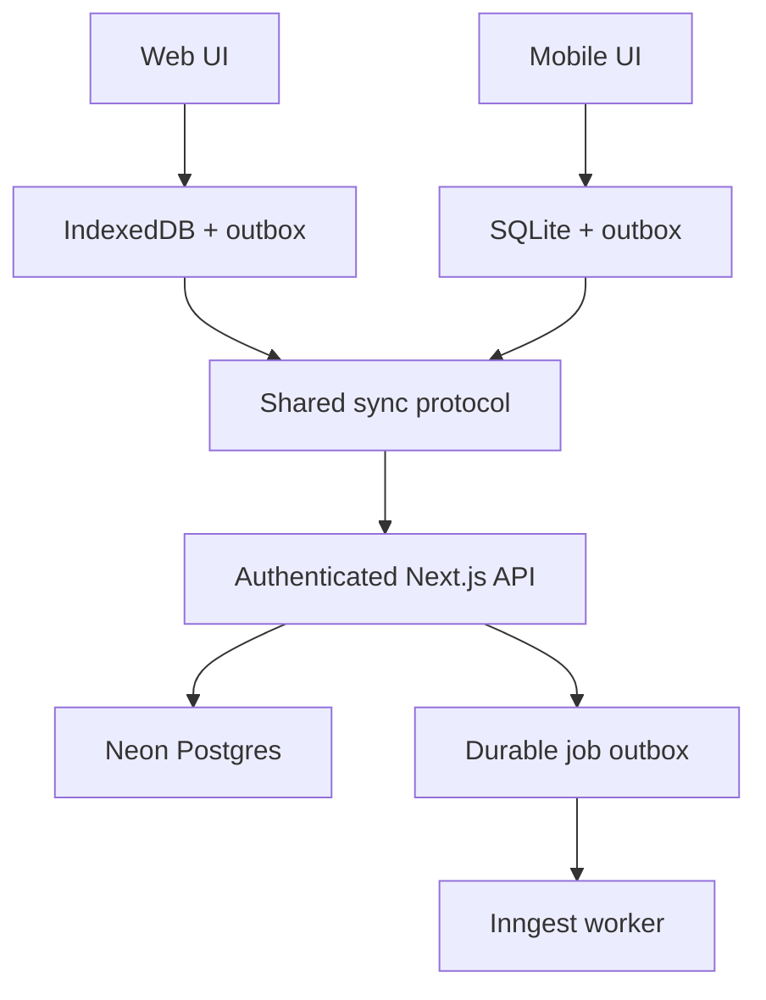

# Architecture and dependency decisions

## Chosen foundation

| Area | Choice | Purpose |
| --- | --- | --- |
| Language/workspace | Strict TypeScript, pnpm workspaces, Turborepo | Reproducible monorepo and shared packages |
| Web | Next.js App Router, React, Tailwind CSS | Full responsive planner and authenticated backend |
| Mobile | Expo, Expo Router, React Native | iOS/Android native app and development builds |
| Authentication | Self-hosted Better Auth with its Expo integration | Apple, Google and email OTP with one user identity |
| Remote database | Neon Postgres | Durable tasks, auth data and sync metadata |
| Database access | Drizzle ORM with a transaction-capable Postgres driver | Explicit schemas and migrations |
| Validation | Zod | Shared validated command and response contracts |
| Web local storage | IndexedDB via Dexie | Durable local state and outbox |
| Mobile local storage | expo-sqlite | Durable local state and outbox |
| Mobile secret storage | expo-secure-store | Session material, isolated from task storage |
| Server jobs | Inngest scheduled functions and events | Durable reminder/outbox processing and reconciliation |
| Email delivery | Resend, behind an email-sender interface | Transactional OTP delivery |
| Notifications | expo-notifications; Expo push service for remote messages | Mobile local/remote adapters |
| Icons | lucide-react / lucide-react-native | Consistent rounded outline icons |
| Mobile gestures | Gesture Handler and Reanimated | Drag/swipe/motion using Expo-compatible versions |
| Web drag | dnd-kit | Accessible drag and drop, plus explicit move actions |
| Tests | Vitest, Playwright, React Native Testing Library, Maestro | Domain, browser and real-device flow coverage |
| Hosting | Vercel for web/API; EAS for mobile builds | Default release targets, subject to authorized provisioning |

These are project choices, not permission to buy plans or publish. Use official package names and installed-version documentation. If a named tool has changed or fails compatibility, record a concrete alternative that preserves its boundary. Do not conflate self-hosted Better Auth with managed Neon Auth.

## Repository structure

Use this logical layout; keep existing project conventions when adapting an established repository:

```text
apps/web           Next.js screens, web local adapter, server routes
apps/mobile        Expo Router screens, native local/notification adapters
packages/domain    Recurrence, civil time, task states, progress, reminder plans
packages/contracts Zod schemas, DTOs, commands, protocol version
packages/sync      Platform-independent sync engine and conflict ordering
packages/db        Drizzle server schema, migrations, repositories
packages/auth      Server auth configuration and safe client entry points
packages/design    Serializable tokens, typography metadata, icon contracts
packages/testkit   Fixtures, fake clock, protocol and adapter test harnesses
docs               Setup, architecture decisions, progress, QA and operations
```

Export server-only packages through explicit entry points. `packages/db` and server auth imports must never be transitively bundled into native or web-client code. Add a build/import guard. Do not force DOM components onto React Native; share data, hooks where portable, tokens and business rules, and use appropriate platform presentation.

## Data flow



Both interfaces read task state from local repositories and apply commands locally first. The shared sync engine pushes pending operations and pulls changes through the same API. The server is the durable multi-device authority; local storage provides immediate and offline behavior. SQL changes, change-feed entries, reminder invalidation and operation acknowledgements are committed consistently.

Do not use React Query caches or AsyncStorage as the durable task database. Do not let web Server Actions become the only write path, because mobile and offline clients need a stable public command API. Server components may handle public/authenticated shell work, while the planner workspace is a client boundary backed by local data.

## Authentication and session boundaries

Mount Better Auth at the conventional `/api/auth/*` backend route using the current Next.js integration. Use web HTTP-only secure cookies and Better Auth's native session handling stored securely on device. Server handlers validate sessions and ownership; native API calls use the documented mechanism appropriate to the installed Better Auth version.

Account linking is explicit and authenticated. Do not join accounts solely because a client supplies the same email. Handle Apple private-relay addresses and first-authorization profile data. Store provider identity by issuer/provider and subject. Do not build a custom session issuer just to bypass a blocked integration.

OTP delivery goes through a backend mail adapter. Domain verification and provider credentials are setup dependencies. No secrets belong in `NEXT_PUBLIC_*` or `EXPO_PUBLIC_*` variables. For local development use a development mail capture or controlled preview recipient, not production OTP logging.

## Time and recurrence

Date-only schedules and recurring wall-clock times use civil fields, not UTC midnight values. Store original dates, IANA zone information for resolved terminal snapshots, and UTC instants for modification/audit times. Pending tasks follow the current device time zone; terminal history retains its recorded interpretation. The server needs a synchronized reminder-device zone to compute remote reminder instants.

Use a date/time library with explicit IANA support and verify compatible runtime behavior on Hermes, browsers and Node. Prefer a tested Temporal-based adapter or a mature equivalent; prohibit `new Date('YYYY-MM-DD')` as a civil-date conversion. Library choice is finalized in stage 02 through shared tests, not separate implementations per platform.

Recurrence is a validated structured rule, not unvalidated free text or a native repeating alarm. Generate discrete occurrences and per-occurrence exceptions in a bounded horizon. Materialize persisted instances lazily, track rule revisions, and keep historical terminal records. Details are in the domain contracts.

## Notifications and job reliability

Local device notifications are the offline delivery path. A device explicitly declares the range of reminders it has locally scheduled; the server does not send equivalent remote alerts for that range. Durable remote reminders serve opted-in devices that do not locally own that occurrence/reminder. Push may also carry best-effort reconciliation cues. See [NOTIFICATIONS.md](NOTIFICATIONS.md) for scheduling budgets and unavoidable cross-device limits.

Keep a transactional job outbox in Postgres. Inngest drains and reconciles it, with retries and idempotency. Do not rely on a Next.js request timer or in-memory jobs. Do not assume a free hosting cron can run every minute. Validate job cadence, costs and quotas against the chosen plan before release.

## API and deployment

Use REST/JSON with shared validation and a versioned `/api/v1` namespace. Next.js handlers run in the Node.js runtime where the chosen Postgres/auth dependencies require it. Use Neon pooled connections for request concurrency and the correct direct migration connection where required. Prove transaction behavior with the selected driver; do not silently replace transactions with batches.

Maintain isolated development, staging and production environments. Give previews disposable Neon branches with separately configured provider callbacks and mail behavior. Keep app identifiers, URL schemes, OAuth credentials, EAS profiles and backend origins environment-specific. Migrations are committed; destructive production changes require explicit authorization and a recovery plan.

## Operational expectations

Structured logs carry request/operation IDs and sanitized errors, not task content, OTPs or credentials. Collect service availability, rejected/lagging sync, job lag, push receipts and mail failures. Handle database suspension/wake-up, transient errors and auth expiry with bounded retries. Logouts and account deletion remove local data and notifications. Set usage budgets and alert thresholds before turning on production workers.

Document assumptions and alternatives with a short ADR: problem, decision, consequence, verification. An alternative auth or sync provider is a material architectural change; explain it to the owner before cutover.
